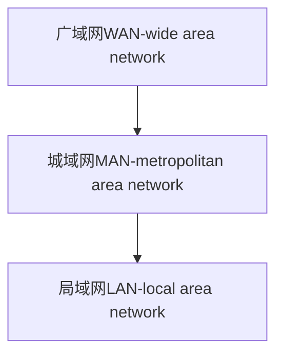
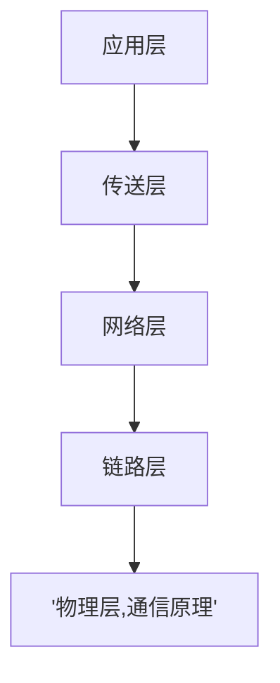
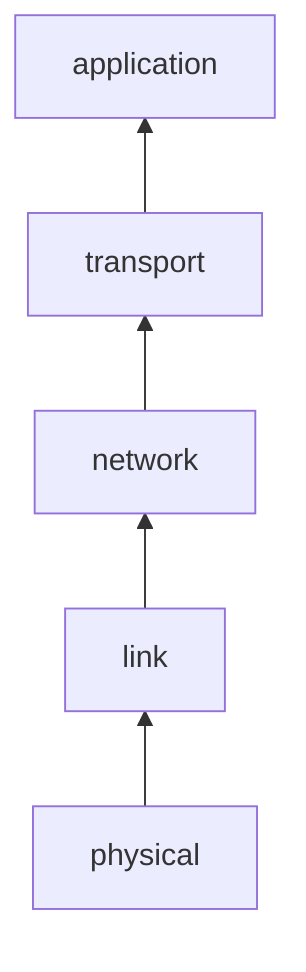
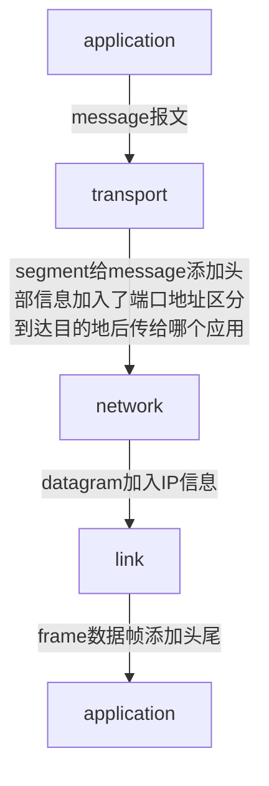
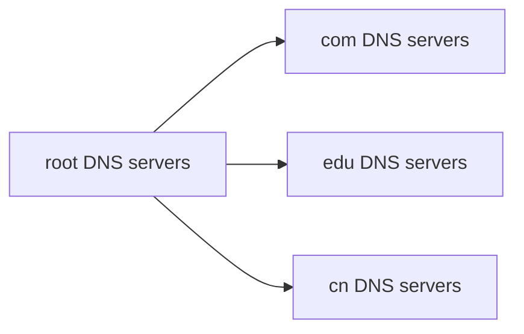
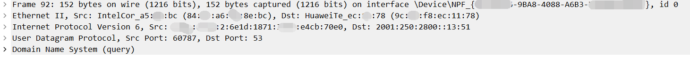
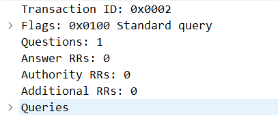

# 计算机网络

- [ ] 作业电子版（考试内容来自于作业）  
- [ ] 网络应用程序（实践大报告）
- [ ] 下次课习题
- [ ] 考试范围：直到3.4

获得协议帮助： RFCs

- 有mooc资源有习题100题算平时考核

  https://www.cnmooc.org/portal/session/courseOutLine/21569.mooc

- 教材computer networking 建议买第五版

   http://wps.pearsoned.com/ecs_kurose_compnetw_6/216/55463/14198700.cw/index.html

- 权威协议文档
  
  http://ietf.org

- 参考书 《TCP/IP详解 卷1：协议》

平时考核，小测试和随堂测验（一般上完后第二次课）

常用简化to--2,for--4

<!-- @import "[TOC]" {cmd="toc" depthFrom=1 depthTo=6 orderedList=false} -->

<!-- code_chunk_output -->

- [计算机网络](#计算机网络)
  - [概论](#概论)
    - [构成](#构成)
    - [network core](#network-core)
    - [packet switching vs circuit switching](#packet-switching-vs-circuit-switching)
    - [Internet structure: network of networks](#internet-structure-network-of-networks)
      - [loss and delay](#loss-and-delay)
        - [occur](#occur)
        - [delay种类](#delay种类)
        - [Internet delays and routes](#internet-delays-and-routes)
    - [服务](#服务)
    - [protocol 协议](#protocol-协议)
      - [TCP/IP](#tcpip)
        - [Layer](#layer)
          - [Internet protocol stack](#internet-protocol-stack)
        - [OSI model](#osi-model)
  - [Application](#application)
    - [HTTP](#http)
      - [Method types](#method-types)
      - [User-server state:cookies](#user-server-statecookies)
      - [web caches(proxy server)](#web-cachesproxy-server)
        - [conditional GET](#conditional-get)
    - [DNS（domain name system）](#dnsdomain-name-system)
    - [DNS records](#dns-records)
      - [DNS protocol](#dns-protocol)
      - [Electronical mail](#electronical-mail)
        - [SMTP](#smtp)
        - [mail access protocol](#mail-access-protocol)
        - [the file transfer protocol](#the-file-transfer-protocol)
        - [p2p](#p2p)
        - [CS architecture](#cs-architecture)
  - [Transport layer](#transport-layer)
    - [TCP service](#tcp-service)
    - [UDP service (User Datagram Protocol) RFC 768](#udp-service-user-datagram-protocol-rfc-768)
  - [net](#net)
  - [考级重点](#考级重点)
    - [AS （Autonomous Sytem自治系统）](#as-autonomous-sytem自治系统)
    - [路由选择协议](#路由选择协议)
      - [RIP](#rip)
      - [OSPF](#ospf)
      - [BGP（Border Gateway Protocol外界网关协议）](#bgpborder-gateway-protocol外界网关协议)

<!-- /code_chunk_output -->

---

typora 目录

[toc]

## 概论

- Internet, network of networks, 相对于public Internet, 还有private intranet
  - computer network计算机网络，Internet!=computer network, Internet是计算机网络的一种
  - Internet和internet的区别, internet是多个computer network互联形成的网络, Internet是指全世界范围的互联网, 相当于Internet是专指，internet是泛指
  - intranet, 内部网络, 内部网络是指在一个网络中的网络，比如一个公司的内部网络，一个公司的外部网络
    - 组成要素：通信链路
    - 目的：通信
    - 核心：分组交换技术
  - network，具有多对多关系的逻辑结构
- protocol
- hosts, end system 可以理解为计算机network中的边缘， 相对的交换机等设备相当于网络中的节点node, node设备也是带有软件的， 一般而言的网络编程只在host上编程， 而不涉及node上的软件
- accessnet
- physical media
- network core: packet/circuit switching(交换方式信息包交换<分组交换方式>), Internet structure
- performance: loss(丢包), delay(延迟), throughput(吞吐量)
- security: encryption(加密), authentication(认证), firewall(防火墙)
- protocol layers, service models(服务模型)

### 构成

按照网络规模分层：




TCP/IP 五层体系(自顶向下)



network从外到内(a service view)


三种网络子系统

- network edge: app and hosts
  
  model：
  peer-peer p2p模式, Skype, 或者文件传递服务， 例如迅雷的P2P下载和百度网盘的加速服务（为其他用户提供自己的带宽）
  cs client/server model
- access network, physical media
  联网方式：
  - dial-up modem(拨号调制解调器)， 由于占用电话线， 可能导致打电话和上网不能同时进行
  - digital modem,  digital subscriber line(DSL), 仍然使用现有的电话网络， 上行带宽小于下行带宽
  - cable modem, HFC(hybrid fiber cable), 电视网络
  - wireless access network
  物理介质：
  - 分类：guided media: 有导向， 衰减弱， unguided media: 无导向， 衰减强，
  TP(Twisted pair, 双绞线)， 一般分三类线和5类线，绞合越紧密传输性能越好
  - coaxial cable, 铜轴电缆
    - baseband(基带), single channel on cable, 不可复用
    - broadband(宽带), multiple channels on cable, 可复用， 通过复用技术解决多频道冲突， broadband是HFC中使用的线缆
  - Fiber Optic cable, 光纤
    - glass fiber carrying light pulses, each pulse a bit
    - 误码率低

### network core

- interconnected routers and switches: 设计意图：相比于完全分布式的网状结构， 能形成类树形网络结构， 减少连线
- circuit switching(电路交换): dedicated cirtcuit per , 独享的回路， 一旦连接建立， 线路上所有资源都被占用, 不能被其他设备使用, 链接断开后才能释放， 要考虑链接时间
  - 优点， 服务质量更好， 链接速度快
  - diving link bandwith:
    - FDM(frequency-division multiplexing) 频分多路复用， 例如收音机按照不同的频率并行传播
    - TDM(time-division multiplexing) 时分多路复用， 相当于操作系统的分时操作系统 
      FDMA 和 TDMA
  - 中间不进行存储

> TCP协议中交换机和路由器不知道链接的存在， 仅仅只有端系统和服务器知道链接
> 

> TCP进行的两个控制
> 1. 拥塞控制：
> 2. 流量
  - packet switching(分组交换)：
    - 存储转发
    - 先存
    - congestion 拥塞控制
    - statical multiplexing(统计复用) 按需分配， （排队， 谁拍到了谁先处理）

提供给APP的通信服务：

- raliable, reliable data delivery from source to destination
- unraliable, "best effort" data delivery, 可能乱序， 信息错误

### packet switching vs circuit switching

例如提供了1 Mb/s link

each user: 100 kb/s when "active"  active 10% of time

| packet switching | circuit switching |
| ---------------- | ----------------- |
| 35users          | 10users           |
|                  |                   |
|                  |                   |

> 计算packet switching 支持的人数算法
> $$
> \begin{cases}
> C_{35}^0P^0(1-P)^{35}
> \\+ ...
> \\ C_{35}^{10}P^{10}(1-P)^{25}
> \end{cases}
> $$

- cuir    性能好，效率高， 高可靠性
- pack    时间效率不高， 成本低
  - 当出现突发业务时更合适

- host
- end system
- communication link
- packet
- packet switch
- router, forward packets
- link-layer switch
- ISP (Internet Service Provider, 网络服务提供商)

### Internet structure: network of networks

区分终端系统和网络核心：
- 终端系统：信素
- 网络核心：

ISP分层：
高等级的ISP为低等级的ISP提供服务，
local ISP: 最接近终端的ISP

离骨干ISP越近的网络越好

#### loss and delay

##### occur

由于packet switching, 在传输过程中不是直达， 而是经过了存储转发， 时间损耗比较明显

##### delay种类

1. nodal processing
  - check bit errors , 如果错误直接丢弃， 重新发送
  - determine output link , 选择往哪转发
2. queueing排队时间
  - time waiting at output link for transmission(等待分组，不是等待比特)
  - depends on congestion level of router
3. transmission delay 传输时延
  - R = link bandwidth(bps), 带宽
  - L = packet length(bits), 分组数据长度
  - time to send bits into link = L/R
  - 影响参数： 分组长度， 链路传输速度
4. propagation delay 传播时延
  - d = length of physical link
  - s = propagation speed in medium
  - 

> 发送到接收的时间是一个传输时延
$$
d = 
$$

**流量强度** traffic intensity = La/R 数值在0-1之间， 没有单位

##### Internet delays and routes

```powershell
ping
tracert # trace route, 路由追踪, 追踪通信路径
```
上面使用ICMP协议，（会探测返回数据， 有的防火墙会组织这种行为， 导致某结点无返回， 显示“请求超时”）

TTL(Time To Live)存活时间， 每次转发都会-1(只有route会)， 当TTL为0时， 该数据包丢失，并返回一个汇报, 告知原主机该数据已丢失

`tracert`的实现：
主机发送一个TTL为1的包， 当抵达第一个路由时就会导致路由返回报告， 然后主机再发送一个TTL为2的包， 使第二个路由返回报告

### 服务

### protocol 协议

**不属于互联网协议栈的**

control sending, receiving of msgs

协议的形式， 文档形式（描述了协议标准）和实现形式（实现协议的程序）

network protocol 的构成：

- syntax， 语法, 格式
- semantics， 语义， 
- timing， 时序, 什么时候发送

protocol 是支配数据通信的规则的集合， 是通信实体之间的一种约定， 例如应用层和应用层, 
？？提供不同层交互， 提供同层级交互？？
具体协议：


- TCP/IP
- HTTP

#### TCP/IP

TCP/IP的含义： TCP/IP为代表的协议族或者协议栈或者体系

##### Layer

层与层之间有调用关系, 上层需要底层的支持， 这决定了层次无法交换

分层的优缺点：
- 
- 

###### Internet protocol stack



通过端口号分离进程

- application layer : surporting network applications 
  - protocol:FTP, SMTP, HTTP
- transport layer : process-process data transfer
  - protocol: TCP, UDP
- network layer : routing of datagrams from source to destination
  - protocol: IP, routing protocols
- link layer : data transfer between neighboring network elements
- physical layer : 

##### OSI model

Open System Interconnection model

相比TCP/IP体系： OSI考虑到同步， 安全，（但是在TCP/IP中这些放到了application中）

> ISO vs OSI
> ISO : International Organization for Standardization, ISO取名来源于希腊语“ISOS”，即“EQUAL”——平等之意
> OSI : Open System Interconnection


协议水平：
服务垂直


每层添加协议的信



在数据源自顶向下封装（加头）， 在数据接收者自底向上解封装（读头）

统一的IP能在全网进行定位， 能通过route进行定位， 在network层进行路由

link层

两台端系统通信中经过的中转：switch(能操作link和physical层), router(能操作networklink和physical层)


PDU protocol data unit 协议数据单元

本课程主要着眼于网络层以上

## Application

Web and HTTP

web page consists of objects, 

each object is addressable by a URL: hostname:端口号/path/filename.ext, 例如：www.baidu.com:80/index.html 由于默认端口号是80所以不用输入:80

对于客户端来说， 端口号可以固定的， 先由

### HTTP

- uses TCP:
  client initiates TCP
  connection(creates )
- HTTP is "stateless"
  server maintains no information about past client requests
  能减少开销
- non-persistent HTTP
  每个对象发送建立链接请求
  RTT(round trip time): time for a small packet to travel from clietn to server and back
  两种请求对象的方式：
  - 建立长期链接， 而非一次请求就连接一次
  - 连发请求， 而不是收到一次response再发下一个请求
- persistent HTTP
  持久和非持久指的是TCP链接

爬虫的规避：

通过请求报文的:User-agent字段如果是浏览器就响应， 如果是爬虫就不响应


HTTP response status code

- 
- 404 not found
- 505 

3表示重定向

#### Method types

HTTP/1.0:

- GET
- POST
- HEAD
  - asks server to leave requested object out of response

HTTP/1.1:

- GET, POST, HEAD
- PUT
  - uploads file in entity body to path specified in URL field
- DELETE
  - deletes file specified in the URL field

HTTP的局限：

传递的信息有限

#### User-server state:cookies

能记录用户状态，包括登陆状态浏览历史等

服务器端存放你的信息，返回给你一个cookie号，通过将该cookies号添加到报文（同时也会存储在本地浏览器）告诉服务器你是谁，它就能获知访问者是谁

#### web caches(proxy server)

goal: satisfy client request without involving origin server

##### conditional GET

如果每次请求都找源服务器，可能受局域网接入公网的带宽限制，解决方法是局域网内用一个


### DNS（domain name system）

即指协议也指一个服务体系

功能

- hostname to IP address translation(映射)

- host aliasing
  - canonical，alias names(一个域名找到不同的服务器)
- mail server aliasing(例如mail.ynu.edu.cn->webmail.ynu.edu.cn)

- load distribution
  - replicated Web servers:many IP address correspond to one name

DNS不能中心化：流量巨大， 容易单点故障



root DNS server:全球13个, 存储顶级域名的IP地址

DNS服务器也有缓存功能， 主机访问某域名时先访问低级的DNS服务器， 如果没有缓存， 就访问更高级的DNS服务器

TLD(top-level domain)servers:

authoritative servers 授权域名服务器

两类查询方法：

- iterated query 迭代查询
- 递归查询

### DNS records

DNS:distributed db storing resource records
```
rrformat:(name, value, type, ttl)
```
type = A
type = NS
type = CNAME
type = MX

#### DNS protocol

DNS: distributed db storing resource records (RR)

RR format: (name, value, type, ttl)

数据包格式: query and reply message, both with same message format

DNS records type: 

- type=A
  - name is hostname
  - value is IP address
- type=CNAME

- type=MX



图片内容自下向上分别为 application --> network --> transport --> protocol --> physical

由 network 层的 user datagram protocol 可知， DNS 是依赖于UDP协议的, 并且询问的服务器默认端口号为 53

> 端口号 port number
> http 服务器的默认端口 80
> DNS 服务器的默认端口 53
> mail server 服务器的默认端口 25
> ftp 服务器的默认端口 连接21 传输20 (带外传输)
> telnet 服务器的默认端口 23
> smtp 服务器的默认端口 25
> pop3 服务器的默认端口 110
> 这些默认端口都是针对服务器端而言的

Domain Name System (query) 报文（DNS协议报文格式）：



DNS 的询问和应答报文格式相同

#### Electronical mail

major components:
- user agents (对于web来说是浏览器, 邮件则是客户端程序或者浏览器)
- mail servers
- simple mail transfer protocol (SMTP)

##### SMTP

端口 25

> http 先连接再拉取 pull
> SMTP 先建立连接直接推送 push

- persistent connections SMTP 是一个长链接(建立连接后，在使用QUIT命令前可多次操作)

##### mail access protocol

- POP (Post Office Protocol) 现在一般用POP3
- IMAP (Internet Message Access Protocol)

##### the file transfer protocol

使用TCP协议

out of band 带外传输， 同时建立两个TCP连接， 将控制信息和数据信息分开传输

##### p2p

> 网络应用结构 ： CS(client-server) / P2P

CS 结构的服务器 IP 固定

P2P 结构是临时的

P2P architecture 解决了 CS 模式中的 S 压力过大的缺点

P2P 能从多个端获得目标文件的一部分，能降低中心化服务器的压力，但是多端管理有一定负担

##### CS architecture

server:

- permant IP address

clients:

- may have dynamic IP address (因为不同的内网给分配不同的 IP)

> process communicating:
> client process: process that initiates the communication
> server process: process that waits to be contacted

Sockets:

process sends/recieves data to/from socket, 需要对 socket 进行标识

基于 TCP 进行socket编程，基于 UDP 进行socket编程

## Transport layer

传输层的重要作用：复用和分复用？？

### TCP service

### UDP service (User Datagram Protocol) RFC 768

transport vs. network layer

network layer: logical communication between hosts

transport layer: physical communication between processes

checksum 中存储 sum 的补码

## net


## 考级重点

### AS （Autonomous Sytem自治系统）

特点：有权决定在本系统内采用何种路由选择协议

- 域内路由选择（inter domain routing）
- 域间路由选择（intra domain routing） 

### 路由选择协议

- Interior Gateway Protocol (IGP)
  - Routing Information Protocol (RIP)路由信息协议
  - Open Shortest Path First (OSPF)开放最短路径优先协议
- External Gateway Protocol (EGP)
  - Border Gateway Protocol (BGP)边界网关协议

对于同时连接内部域和外部域的路由器，既要运行IGP又要运行EGP

> 路由选择协议 vs 路由选择算法
>
> - 路由选择协议： 路由器用来完成路由表建立和路由信息更新的通信协议
> - 路由选择算法： 主机和路由器通过路由选择算法形成路由表，以确定发送分组的传输路径

> gateway vs router
> 由区别但是习惯上不加区分gateway $\approx$ router

#### RIP

#### OSPF

主要特征：使用（link state protocol）分布式链路状态协议

#### BGP（Border Gateway Protocol外界网关协议）

至少要有一个路由器作为自制系统的“BGP发言人”， 一个BGP发言人与其他自制系统的BGP发言人要交换路由信息， 需要先建立TCP连接， 然后此链接上交换BGP报文以建立BGP会话

> - BGP采用路由向量协议
> - RIP采用距离向量协议
> - OSPF采用分布式链路状态协议

DNS 四点服务

RDT (Reliable Data Transport)
UDT (Unreliable Data Transport)

中英对照
---

- ethernet (以太网)
- TCP/IP (transmission control protocol/internet protocol, 传输控制协议/互联网协议), 链接不同网络和计算机之间的通信
- UDP(User Datagram Protocol)
- WAN wide-area network
- LAN local-area network
- access internet接入网络
- RFC 
- ARPA (Advanced Research Project Agency)
- ARPAnet, internet的前身
- SMTP (Simple Mail Transfer Protocol)
- HTTP (hypertext transport protocol, 超文本传输协议)
- HTML (hypertext markup language)
- DNS (Domain Name System/Domain Name Server, 域名系统/域名服务器)
- ICP (Internet Content Provider, 互联网内容提供商, 例如百度等)
- fiber 光纤
- transmission rate 发送速率 = bandwidth 带宽, hz常常用在模拟通信中， 而数字通信常用bps， 带宽原来也是使用在模拟通信中的， 后来混用了
- RFC (Request For Comments), TCP/IP的文档形式， 几乎所有互联网标准都收录到RFC文件中
- inf
- 

---